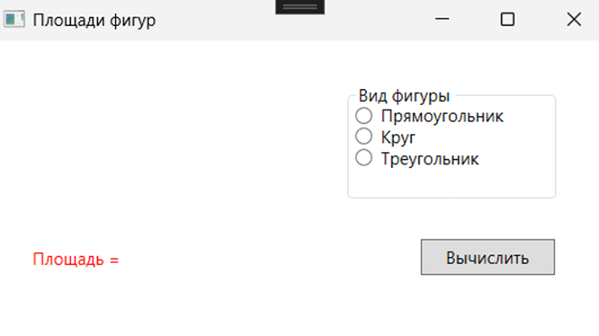
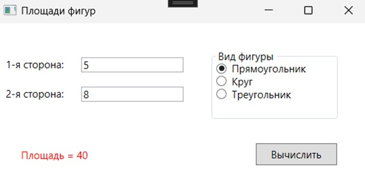
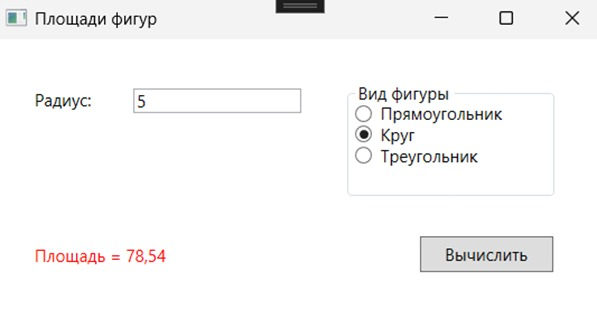
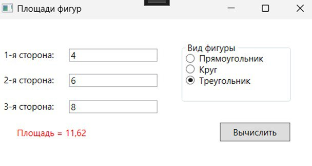

# Практическая работа №3. Отладка программы различными способами

## Способы отладки Microsoft Visual Studio, которые были использованы в этом задании:
- **точки останова** – для пошагового анализа выполнения кода;
- **стек вызовов** – для отслеживания последовательности вызова методов;
- **точки трассировки** – для логирования значений переменных во время работы программы.

## Скриншоты запущенного приложения с результатами работы:
### Интерфейс приложения

### Вычисление площади прямоугольника

### Вычисление площади круга

### Вычисление площади треугольника

